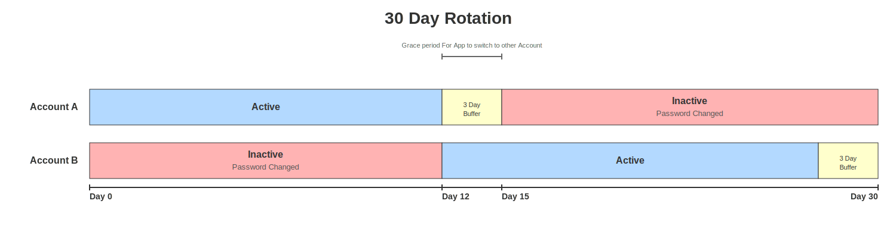

# Vault Rotating Service Accounts Plugin

This HashiCorp Vault plugin enables password rotation for service accounts on a single LDAP server, with support for **dual-account rotation** to ensure zero-downtime credential updates.

## Why This Plugin is Necessary

Traditional password rotation for LDAP service accounts creates a critical window of vulnerability: when a password is rotated, applications using cached credentials continue authenticating with the old password until they refresh their credentials from Vault. During this gap, authentication failures occur, potentially causing application outages. This plugin solves this problem through dual-account rotation, where two service accounts alternate between active and inactive states with a configurable grace period.

## Dual-Account Rotation

Dual-account rotation solves the problem of applications using stale credentials during rotation. Instead of rotating a single account's password, the plugin manages two accounts and switches between them.

### How It Works



1. **account_a** is active, applications use its credentials
2. When rotation period expires, **account_b**'s password is rotated
3. Grace period begins - both accounts have valid, known passwords
4. After grace period, **account_b** becomes active
5. Cycle repeats with **account_a** as the next rotation target


## Features

- **Dual-account rotation**: Rotates between two service accounts (account_a/account_b) with grace periods on single server
- **Grace period support**: Configurable overlap period where both old and new credentials work
- **Previous password tracking**: Maintains history of rotated passwords with timestamps
- **Configurable rotation period**: Set automatic rotation interval
- **Secure password generation**: Cryptographically secure random passwords
- **Native Vault integration**: Full Vault audit logging and security features
- **Single-account mode**: Also supports traditional single-account rotation for backward compatibility

## Prerequisites

- Go 1.21 or later
- HashiCorp Vault 1.12+ (development mode for testing)
- One LDAP server (or test server via Docker)
- LDAP admin credentials with password modification permissions

## Quick Start

### 1. Start Docker LDAP Servers

```bash
make docker-ldap
# Wait for servers to start, then add test users:
make docker-adduser
```

### 2. Start Vault Dev Server (in another terminal)

```bash
export VAULT_ADDR='http://127.0.0.1:8200'
export VAULT_TOKEN='root'
make dev
```

### 3. Register and Enable the Plugin

```bash
make register
make enable
```

### 4. Or Configure for Dual-Account Mode (Recommended)

First, create the dual test accounts on the ldap server:
```bash
make docker-add-dual-accounts
```

Then configure Vault to manage them:
```bash
make configure-ldap
make create-dual-account-role ROLE=myapp
```

### Configure Dual-Account Mode

```bash
# Configure the LDAP connection
vault write rotating-service-accounts/config \
    url=ldap://localhost:389 \
    binddn="cn=admin,dc=learn,dc=example" \
    bindpass="2LearnVault" \
    userdn="ou=users,dc=learn,dc=example" \
    username="svcaccount"

# Create a dual-account static role
vault write rotating-service-accounts/static-role/myapp \
    username_a="appuser_a" \
    username_b="appuser_b" \
    rotation_period=1209600 \
    grace_period=259200 \
    dual_account_mode=true \
    password_length=32
```

**Parameters:**
- `username_a`: First LDAP account username (e.g., appuser_a)
- `username_b`: Second LDAP account username (e.g., appuser_b)
- `rotation_period`: How often to rotate (seconds) - e.g., 1209600 = 2 weeks
- `grace_period`: Overlap period (seconds) - e.g., 259200 = 3 days
- `dual_account_mode`: Must be `true` for dual-account rotation
- `password_length`: Length of generated passwords

### Read Dual-Account Credentials

```bash
vault read rotating-service-accounts/static-cred/myapp
```

**Response includes:**
```json
{
  "username": "appuser_a",
  "password": "generated-password",
  "account": "appuser_a",
  "rotation_state": "account_a_active",
  "is_active": true,
  "last_rotated": 1766012000,
  "last_rotated_formatted": "2025-12-17T14:53:20-08:00",
  "metadata": {
    "account_a": {
      "username": "appuser_a",
      "status": "active",
      "last_rotated": 1766012296,
      "previous_password": "old-password"
    },
    "account_b": {
      "username": "appuser_b",
      "status": "inactive",
      "last_rotated": 1766012476,
      "previous_password": "old-password"
    }
  }
}
```

### Test Credentials Work on LDAP Server

```bash
# Manually test (always use BOTH username and password from Vault)
eval $(vault read -format=json rotating-service-accounts/static-cred/myapp | jq -r '@sh "USER=\(.data.username) PASS=\(.data.password)"')
ldapwhoami -H ldap://localhost:389 -D "cn=$USER,ou=users,dc=learn,dc=example" -w "$PASS"
```

### Watch Rotation State

```bash
# Watch rotation state by repeatedly reading credentials
watch -n 5 'vault read rotating-service-accounts/static-cred/myapp'
```

## Single-Account Mode (Legacy)

For simpler use cases, the plugin also supports single-account rotation:

```bash
# Create role
make create-dual-account-role ROLE=myapp

# Get credentials
make get-role-creds ROLE=myapp

# Manual rotation
make rotate-role ROLE=myapp
```

## Available Make Commands

### Building & Development

| Command | Description |
|---------|-------------|
| `make build` | Build the plugin |
| `make build-prod` | Build production binary (static) |
| `make clean` | Remove build artifacts |
| `make deps` | Download dependencies |
| `make tidy` | Tidy dependencies |
| `make test` | Run tests |
| `make fmt` | Format code |
| `make vet` | Run go vet |
| `make sha256` | Calculate plugin SHA256 |

### Vault Plugin Management

| Command | Description |
|---------|-------------|
| `make dev` | Start Vault dev server with plugin |
| `make register` | Register plugin with Vault |
| `make enable` | Enable plugin at `rotating-service-accounts/` path |
| `make disable` | Disable plugin |
| `make setup` | Full setup (register, enable, configure) |
| `make teardown` | Full teardown (disable) |
| `make reload` | Reload plugin (disable, register, enable) |

### Docker LDAP Test Environment

| Command | Description |
|---------|-------------|
| `make docker-ldap` | Start OpenLDAP test server |
| `make docker-clean` | Stop and remove LDAP server |
| `make docker-adduser` | Add test user to server |
| `make docker-verify` | Verify LDAP server and test user |
| `make docker-setup` | Complete setup (server + users) |
| `make docker-add-dual-accounts` | Add dual accounts to server |

### Configuration & Credentials

| Command | Description |
|---------|-------------|
| `make configure` | Configure plugin (generic) |
| `make configure-ldap` | Configure for Docker LDAP servers |
| `make read-config` | Read plugin configuration |
| `make creds` | Get current credentials |
| `make rotate` | Trigger manual rotation |

### Static Role Management

| Command | Description |
|---------|-------------|
| `make create-dual-account-role ROLE=name` | Create dual-account role (requires dual accounts in LDAP) |
| `make read-role ROLE=name` | Read static role configuration |
| `make read-role-state ROLE=name` | Read rotation state (dual-account mode only) |
| `make get-role-creds ROLE=name` | Get credentials for a role |
| `make rotate-role ROLE=name` | Manually rotate password for a role |
| `make delete-role ROLE=name` | Delete a static role |

### Dual-Account Setup & Testing

| Command | Description |
|---------|-------------|
| `make docker-add-dual-accounts` | Create appuser_a and appuser_b test accounts in LDAP |
| `make docker-verify-dual-accounts` | Verify dual accounts exist in LDAP |
| `make configure-ldap` | Configure Vault with LDAP connection |

## Building the Plugin

### Standard Build

```bash
make build
```

### Production Build

```bash
make build-prod
```

### Calculate SHA256

```bash
make sha256
```

## Production Deployment

### 1. Build for Production

```bash
make build-prod
```

### 2. Copy to Vault Plugin Directory

```bash
# Copy to Vault's plugin directory (example path)
sudo cp rotating-service-accounts /etc/vault/plugins/
sudo chmod +x /etc/vault/plugins/rotating-service-accounts
```

### 3. Configure Vault

Add to your Vault configuration file (`/etc/vault/vault.hcl`):

```hcl
plugin_directory = "/etc/vault/plugins"
```

### 4. Register and Enable

```bash
# Calculate SHA256
SHA256=$(shasum -a 256 /etc/vault/plugins/rotating-service-accounts | cut -d ' ' -f1)

# Register
vault plugin register \
  -sha256="${SHA256}" \
  secret \
  rotating-service-accounts

# Enable
vault secrets enable \
  -path=rotating-service-accounts \
  rotating-service-accounts
```

### 5. Security Considerations

- **Use LDAPS**: In production, use `ldaps://` URLs (port 636) for encrypted connections
- **Secure bind credentials**: Store admin credentials securely
- **Audit logging**: Enable Vault audit logging
- **Access control**: Use Vault policies to restrict access
- **Rotation frequency**: Consider appropriate rotation periods for your use case
- **Grace periods**: Ensure grace period > application credential refresh interval

### 6. Example Production Configuration

```bash
vault write rotating-service-accounts/config \
    url="ldaps://ldap-server.prod.example.com:636" \
    binddn="cn=vault-admin,ou=service-accounts,dc=example,dc=com" \
    bindpass="<secure-password>" \
    userdn="ou=service-accounts,dc=example,dc=com"

vault write rotating-service-accounts/static-role/myapp \
    username_a="myapp-svc-a" \
    username_b="myapp-svc-b" \
    dual_account_mode=true \
    rotation_period=1209600 \
    grace_period=259200 \
    password_length=32
```

## Troubleshooting

### Plugin not found
```bash
# Check plugin registration
vault plugin list secret

# Re-register if needed
SHA256=$(shasum -a 256 rotating-service-accounts | cut -d ' ' -f1)
vault plugin register -sha256="${SHA256}" secret rotating-service-accounts
```

### LDAP connection failures
```bash
# Test LDAP connectivity
ldapsearch -x -H ldap://localhost:389 -D "cn=admin,dc=learn,dc=example" -w 2LearnVault -b "dc=learn,dc=example"
```

### Credentials not working
```bash
# Always use BOTH username and password from Vault response
# The active account changes during rotation!
eval $(vault read -format=json rotating-service-accounts/static-cred/myapp | jq -r '@sh "USER=\(.data.username) PASS=\(.data.password)"')
echo "Active account: $USER"
ldapwhoami -H ldap://localhost:389 -D "cn=$USER,ou=users,dc=learn,dc=example" -w "$PASS"
```

### Check rotation state
```bash
vault read -format=json rotating-service-accounts/static-cred/myapp | jq '{username: .data.username, rotation_state: .data.rotation_state, metadata: .data.metadata}'
```

### Password rotation fails
```bash
# Check Vault logs
journalctl -u vault -f

# Verify LDAP permissions
# Ensure bind DN has permission to modify userPassword attribute
```

## API Reference

### Configuration

```
POST /rotating-service-accounts/config
{
  "url": "ldap://server:389",
  "binddn": "cn=admin,dc=example,dc=com",
  "bindpass": "password",
  "userdn": "ou=users,dc=example,dc=com",
  "userattr": "cn",
  "username": "svcaccount",
  "rotation_period": 60,
  "password_length": 32
}
```

### Read Configuration

```
GET /rotating-service-accounts/config
```

### Static Role (Single-Account)

```
POST /rotating-service-accounts/static-role/{name}
{
  "username": "svcaccount",
  "rotation_period": 60,
  "password_length": 32
}
```

### Static Role (Dual-Account)

```
POST /rotating-service-accounts/static-role/{name}
{
  "username_a": "account_a",
  "username_b": "account_b",
  "dual_account_mode": true,
  "rotation_period": 86400,
  "grace_period": 259200,
  "password_length": 32
}
```

### Read Credentials

```
GET /rotating-service-accounts/static-cred/{name}
```

### Manual Rotation

```
POST /rotating-service-accounts/rotate-role/{name}
```

## Development

### Running Tests

```bash
make test
```

### Code Structure

- `main.go`: Main plugin code
  - `Factory`: Plugin initialization
  - `dualLDAPBackend`: Backend implementation
  - `ldapConfig`: Configuration structure
  - `staticRole` / `dualAccountRole`: Role definitions
  - `rotatePassword`: Core rotation logic
  - `updateLDAPPassword`: LDAP update function
  - `generatePassword`: Secure password generator
  - `dualAccountStateMachine`: State transitions for dual-account rotation

## License

This plugin is provided as-is for demonstration and development purposes.

## Support

For issues and questions, please open an issue in the repository.
